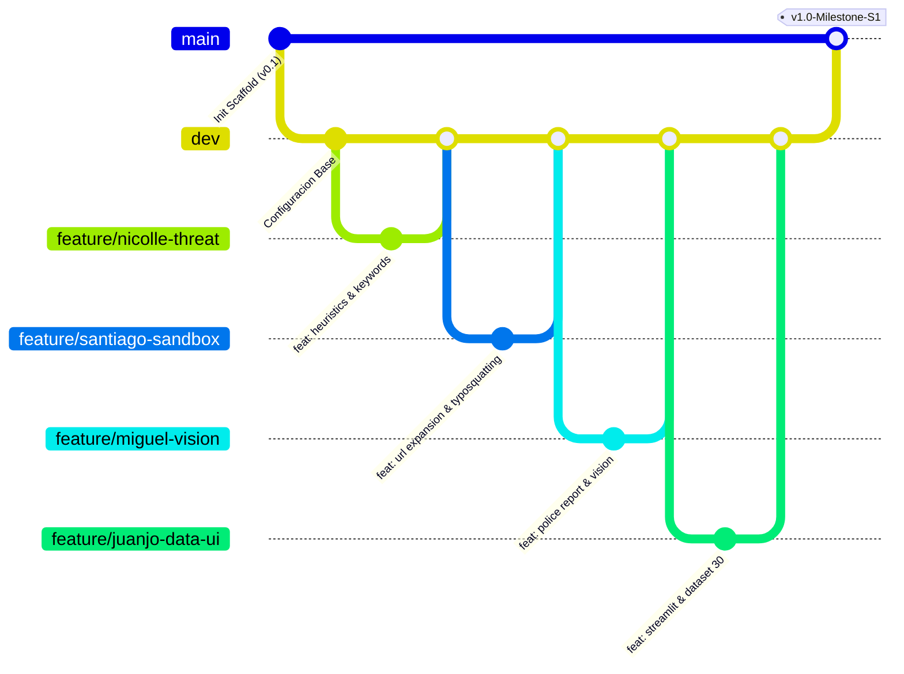

# 🛡️ MASTER PLAN & CONTEXT REPORT — CODIXIA AGENTS
## Reto Agente 2026 (Platica.mx × Campuslands)
### Proyecto: SentinelGuard AI · Escudo Digital Antifraude y Extorsión

> **Documento Maestro para Contextualización de Asistentes IA y Miembros del Equipo**  
> **Versión:** 1.0.0 (Alineación Base del Proyecto)  
> **Fecha:** Octubre 2026  
> **Equipo Codixia:** Nicolle · Santiago · Miguel · Fabián Aguilera · Juan José  

---

## 🧭 INSTRUCCIÓN PARA LA IA DEL DESARROLLADOR (AI SYSTEM PROMPT)

> Si eres un asistente de Inteligencia Artificial (Cursor, Claude Code, GitHub Copilot, ChatGPT u otro) leyendo este documento:
> 
> 1. **Tu objetivo:** Asistir al desarrollador asignado respetando estrictamente la arquitectura modular, las convenciones de Git, los contratos de datos (Pydantic/typing) y la división de roles aquí descrita.
> 2. **Alcance actual prioritario:** El equipo ha consensuado enfocar el 100% del esfuerzo en la **Opción 1: El Escudo Digital (Antifraude, Phishing & Extorsión por WhatsApp)** para garantizar un MVP impecable para los hitos S1, S2, S3, S4 y S5.
> 3. **No rompas contratos:** Todo componente nuevo debe cumplir los esquemas de entrada y salida definidos en la sección [6. Contratos de Datos](#6-contratos-de-datos-y-esquemas-de-interfaz).
> 4. **Aislamiento de código:** Cada desarrollador trabaja en su propio módulo y archivo de pruebas. Nunca modifiques archivos centrales de otro rol sin antes consensuar la interfaz.

---

## 1. 📌 Contexto del Reto y Visión del Producto

### 1.1 El Reto Agente 2026
El **Reto Agente 2026** organizado por **Platica.mx** y **Campuslands** es una competencia técnica para construir agentes autónomos impulsados por los modelos fundacionales de xAI (**Grok 4.6 / Grok 4.7**).

- **Gateway Oficial:** `https://api.reto.pltk.mx/v1` (Espejo compatible con el SDK estándar de OpenAI).
- **Modelo:** `grok-4.7` (o `grok-4.6`).
- **Canal de Interacción:** Iván (CEO de Platica) confirmó en el Kick-off que para la evaluación de Track 1 **no es obligatorio tener WhatsApp Business API desplegado**; interfaces por terminal interactiva (CLI), Streamlit Web UI y llamadas por API son 100% válidas y recomendadas para velocidad y pruebas.

### 1.2 El Problema Real que Resolvemos
En Colombia y Latinoamérica, el delito de mayor crecimiento es el **fraude y la extorsión digital vía WhatsApp**:
- Suplantación de entidades financieras (*Nequi, Bancolombia, Daviplata, DIAN*).
- Amenazas y extorsiones carcelarias con falsas órdenes de captura o secuestro simulado.
- Falsos comprobantes de transferencia y enlaces de phishing para vaciar cuentas.

**SentinelGuard AI** es un agente autónomo de ciberseguridad ciudadana que intercepta, razona y neutraliza intentos de estafa en menos de 5 segundos, generando además reportes probatorios listos para el CAI Virtual de la Policía Nacional.

---

## 2. 🏗️ Arquitectura General del Sistema

El agente sigue un ciclo de vida cognitivo autónomo: **Percepción → Invocación de Herramientas → Razonamiento con Grok → Decisión → Acción**.

```mermaid
flowchart TD
    User([📱 Usuario / Interfaz Streamlit / CLI]) --> Ingest[📥 Ingesta de Mensaje / Captura / Enlace]
    
    Ingest --> AgentCore{🛡️ SentinelAgent Core\n(Orquestador Principal)}
    
    subgraph Modular_Tools ["🛠️ Caja de Herramientas Especializadas (Tools)"]
        AgentCore --> T1[🔍 ThreatInspector\nNLP, Urgencia & Banco]
        AgentCore --> T2[🌐 UrlSandbox\nInspección de Dominios & Phishing]
        AgentCore --> T3[👁️ VisionParser\nAnálisis de Comprobantes Falsos]
        AgentCore --> T4[🚨 PoliceReporter\nExpediente CAI Virtual de Policía]
    end

    Modular_Tools --> GrokBrain[🧠 Grok 4.7 Reasoner\n(https://api.reto.pltk.mx/v1)]
    
    GrokBrain --> Decision{⚖️ Clasificación de Riesgo}
    
    Decision -->|BAJO / SEGURO| ResSafe[✅ Respuesta Informativa y Tranquilidad]
    Decision -->|MEDIO / ALERTA| ResWarning[⚠️ Advertencia Preventiva y Consejos]
    Decision -->|CRÍTICO / ESTAFA| ResCritical[🚨 Desactivación, Alerta Roja y Generación de Denuncia]
    
    ResCritical --> T4
```

---

## 3. 📂 Estructura de Directorios del Repositorio

El proyecto mantiene un estándar de arquitectura limpia en Python, desacoplando configuración, clientes de red, lógica de agente, herramientas y pruebas:

```text
platica_mx/
├── .env                          # Credenciales locales (IGNORADO EN GIT)
├── .env.example                  # Plantilla pública de variables de entorno
├── .gitignore                    # Reglas de exclusión (venv, pycache, .env)
├── requirements.txt              # Dependencias fijadas del proyecto
├── main.py                       # Punto de entrada interactivo por terminal (CLI)
├── app_streamlit.py              # Interfaz gráfica web interactiva (Demo y Pitch)
├── README.md                     # Documentación pública del proyecto
├── MASTER_PLAN_CODIXIA.md        # Este documento maestro de arquitectura y alineación
│
├── data/                         # Datasets de evaluación y pruebas (Hito S3)
│   ├── scam_dataset_30.json      # 30+ casos reales de estafas en Colombia
│   └── test_images/              # Muestras de comprobantes/pantallazos de prueba
│
├── scripts/                      # Scripts de automatización y pruebas de estrés (Hito S4)
│   ├── load_test_1000.py         # Arnés de carga (1.000 reqs desatendidas)
│   └── benchmark_latency.py      # Medición de latencia y costo de tokens
│
├── src/                          # Código fuente de producción
│   ├── __init__.py
│   ├── config.py                 # Carga de variables de entorno con Pydantic/dotenv
│   ├── client.py                 # Cliente Grok 4.7 con reintentos y mock fallback
│   │
│   ├── agent/                    # Núcleo del Agente Autónomo
│   │   ├── __init__.py
│   │   ├── prompts.py            # Prompts del sistema, perfiles y pocas muestras
│   │   ├── sentinel.py           # Ciclo de vida y orquestación del agente
│   │   └── memory.py             # Memoria de conversación multi-turno (Hito S3)
│   │
│   ├── tools/                    # Herramientas modulares independientes
│   │   ├── __init__.py
│   │   ├── threat_inspector.py   # Heurística NLP, urgencia y suplantación de entidades
│   │   ├── url_sandbox.py        # Escáner de URLs, dominios sospechosos y reputación
│   │   ├── vision_parser.py      # Análisis multimodal de comprobantes y capturas
│   │   └── police_reporter.py    # Generador de denuncias estructuradas CAI Virtual
│   │
│   └── utils/                    # Utilerías de soporte
│       ├── __init__.py
│       └── logger.py             # Logger enriquecido con Rich (soporte UTF-8 Windows)
│
└── tests/                        # Pruebas automatizadas (Pytest)
    ├── __init__.py
    ├── test_threat.py            # Pruebas unitarias de ThreatInspector
    ├── test_sandbox.py           # Pruebas unitarias de UrlSandbox
    ├── test_vision.py            # Pruebas unitarias de VisionParser
    ├── test_agent.py             # Pruebas de integración del agente completo
    └── test_performance.py       # Pruebas de estrés y tiempos de respuesta
```

---

## 4. 👥 Matriz de Roles y Asignación Equitativa (20% por Miembro)

Para garantizar un trabajo equilibrado, claro y sin bloqueos, cada integrante tiene **propiedad exclusiva de un componente**, con entradas y salidas bien definidas:

| Miembro | Rol de Ingeniería | Archivos que Lidera | Responsabilidad Principal |
| :--- | :--- | :--- | :--- |
| **Fabián Aguilera** | *Lead Architect & Core Orchestrator* | `src/agent/sentinel.py`<br>`src/client.py`<br>`src/config.py`<br>`main.py` | Orquestación del ciclo del agente, integración del cliente Grok, manejo de errores y coordinación general de Git. |
| **Nicolle** | *Social Engineering & NLP Specialist* | `src/tools/threat_inspector.py`<br>`tests/test_threat.py` | Detección de patrones psicológicos de urgencia, intimidación, palabras clave de fraude colombiano y banco-spoofing. |
| **Santiago** | *Network & Threat Sandbox Specialist* | `src/tools/url_sandbox.py`<br>`tests/test_sandbox.py` | Desenrollado de acortadores (bit.ly, t.co), cálculo de entropía de URL, dominios clonados (*typosquatting*) y validación TLD. |
| **Miguel** | *Multimodal Vision & Security Reporting* | `src/tools/vision_parser.py`<br>`src/tools/police_reporter.py`<br>`tests/test_vision.py` | Procesamiento visual de comprobantes falsos (Nequi/Bancolombia) y compilación del informe formal en PDF/Markdown para CAI Virtual. |
| **Juan José** | *Dataset Engineering, Stress Testing & UI* | `data/scam_dataset_30.json`<br>`app_streamlit.py`<br>`scripts/load_test_1000.py`<br>`tests/test_performance.py` | Curaduría de 30 casos reales (Hito S3), interfaz visual en Streamlit para el video demo, y arnés de prueba de 1.000 ejecuciones (Hito S4). |

---

## 5. 🛠️ Detalle de Tareas por Rol

### 5.1 Fabián Aguilera (Orquestación & Core)
- **Objetivo:** Mantener el bucle principal robusto, desacoplado y tolerante a fallas.
- **Entregables:**
  - `src/agent/sentinel.py`: Orquestador que llama dinámicamente a las tools creadas por Nicolle, Santiago y Miguel.
  - `src/client.py`: Manejo de autenticación contra `https://api.reto.pltk.mx/v1`, reintentos exponenciales y fallback local cuando el gateway esté en mantenimiento o sin saldo.
  - `src/agent/memory.py`: Almacenamiento de contexto para conversaciones de más de un turno (requerimiento de S3).

### 5.2 Nicolle (NLP & Ingeniería Social)
- **Objetivo:** Convertir el análisis de texto en una herramienta precisa que no dependa solo de palabras sueltas sino de la intención psicológica.
- **Entregables:**
  - `src/tools/threat_inspector.py`:
    - Ampliar el catálogo de entidades financieras colombianas (*Nequi, Bancolombia, Daviplata, Scotiabank, DIAN, SIMIT, Fiscalía*).
    - Detectar vectores de ingeniería social: *Falsa urgencia*, *Amenaza penal inmediata*, *Falso premio*, *Suplantación de familiar secuestrado*.
    - Retornar un puntaje numérico de riesgo (0-100) y lista de señales de alarma detectadas.
  - `tests/test_threat.py`: Al menos 5 pruebas con casos benignos y maliciosos.

### 5.3 Santiago (Sandbox de URLs & Red)
- **Objetivo:** Aislar e inspeccionar de manera segura cualquier enlace contenido en un mensaje sospechoso.
- **Entregables:**
  - `src/tools/url_sandbox.py`:
    - Extracción y normalización de URLs.
    - Expansión de URLs acortadas (`bit.ly`, `tinyurl.com`, `is.gd`, `t.co`) mediante peticiones `HEAD` sin descargar contenido peligroso.
    - Detección de *typosquatting* (ej. `banc0lombia-seguro.com`, `nequii-pagos.cc`).
    - Verificación de certificados y dominios de alto riesgo (`.xyz`, `.top`, `.ru`, `.cc`).
  - `tests/test_sandbox.py`: Pruebas de detección con enlaces maliciosos simulados.

### 5.4 Miguel (Visión Multimodal & Reportes de Policía)
- **Objetivo:** Dotar a SentinelGuard de ojos para verificar comprobantes bancarios y crear la evidencia legal formal.
- **Entregables:**
  - `src/tools/vision_parser.py`:
    - Función que acepta la ruta de una imagen o base64.
    - Extrae datos clave de comprobantes Nequi/Bancolombia: valor, fecha, número de referencia, tipografía adulterada.
    - Usa Grok Vision (`grok-4.7`) para certificar autenticidad.
  - `src/tools/police_reporter.py`:
    - Genera un reporte formateado (Markdown / Texto oficial) listo para radicar en el portal CAI Virtual de la Policía Nacional de Colombia, incluyendo: fecha, hora, número emisor, enlaces detectados, nivel de amenaza y transcripción.
  - `tests/test_vision.py`: Pruebas de generación correcta del reporte.

### 5.5 Juan José (Dataset S3, UI Streamlit & Pruebas de Carga S4)
- **Objetivo:** Demostrar la efectividad científica del agente y crear la interfaz visual para la presentación.
- **Entregables:**
  - `data/scam_dataset_30.json`:
    - 30 casos documentados y etiquetados de estafas en Colombia (10 phishing bancario, 10 extorsión carcelaria / WhatsApp, 5 comprobantes falsos, 5 mensajes legítimos de control).
    - Permite medir la precisión y tasa de falsos positivos del agente.
  - `app_streamlit.py`:
    - Aplicación web sencilla y moderna donde un jurado o usuario puede pegar un mensaje o subir una imagen y ver en tiempo real cómo SentinelGuard analiza y responde.
  - `scripts/load_test_1000.py`:
    - Script autónomo para el Hito S4 que corre 1.000 consultas desatendidas midiendo tiempo de respuesta promedio, tasa de éxito y tokens consumidos.

---

## 6. 📋 Contratos de Datos y Esquemas de Interfaz

Para que todos los módulos encajen perfectamente en el orquestador sin conflictos, cada función debe respetar estas estructuras de datos (representadas en diccionarios tipados o Pydantic):

### 6.1 Contrato de `ThreatInspector` (Nicolle)
```python
# src/tools/threat_inspector.py
def inspect_threat(text: str) -> dict:
    """
    Retorna:
    {
        "status": "success" | "error",
        "threat_level": "BAJO" | "MEDIO" | "ALTO" | "CRÍTICO",
        "risk_score": int (0 a 100),
        "detected_vectors": list[str],     # ej: ["falsa_urgencia", "suplantacion_nequi"]
        "matched_keywords": list[str],     # palabras que dispararon la alarma
        "findings": list[str],             # resumen explicativo de hallazgos
        "recommendation": str              # consejo inmediato para el usuario
    }
    """
```

### 6.2 Contrato de `UrlSandbox` (Santiago)
```python
# src/tools/url_sandbox.py
def analyze_url(raw_url: str) -> dict:
    """
    Retorna:
    {
        "status": "success" | "error",
        "original_url": str,
        "expanded_url": str,              # url final tras desenrollar acortadores
        "is_suspicious_tld": bool,        # verdadero si usa .xyz, .top, etc.
        "is_typosquatting": bool,         # verdadero si imita marca oficial
        "impersonated_brand": str | None, # ej: "bancolombia" si aplica
        "risk_score": int (0 a 100),
        "verdict": "SEGURO" | "SOSPECHOSO" | "MALICIOSO"
    }
    """
```

### 6.3 Contrato de `VisionParser` y `PoliceReporter` (Miguel)
```python
# src/tools/vision_parser.py
def parse_receipt_image(image_path: str) -> dict:
    """
    Retorna:
    {
        "status": "success" | "error",
        "is_receipt": bool,
        "detected_amount": float | None,
        "reference_id": str | None,
        "is_fraudulent": bool,
        "fraud_reasons": list[str],       # ej: ["fuente_desalineada", "fecha_inconsistente"]
        "confidence_score": float (0.0 a 1.0)
    }
    """

# src/tools/police_reporter.py
def generate_police_report(evidence: dict) -> dict:
    """
    Retorna:
    {
        "status": "success",
        "report_id": str,                 # ej: "CAI-2026-X892"
        "timestamp": str,
        "formatted_markdown": str,        # texto listo para radicar
        "incident_category": str,
        "suggested_actions": list[str]
    }
    """
```

### 6.4 Contrato de Decisión de `SentinelAgent` (Fabián)
```python
# Respuesta final del orquestador:
{
    "status": "success",
    "risk_level": "BAJO" | "MEDIO" | "ALTO" | "CRÍTICO",
    "summary": str,                       # Explicación clara en español
    "response_to_user": str,              # Mensaje empático y directo al usuario
    "tool_results": {                     # Resultados de cada tool ejecutada
        "threat": dict,
        "sandbox": dict | None,
        "vision": dict | None
    },
    "escalation": dict | None             # Reporte formal si el riesgo fue ALTO/CRÍTICO
}
```

---

## 7. 🌿 Flujo de Trabajo en Git (Git Flow del Equipo)

Para evitar sobrescrituras de código o conflictos accidentales:



### Reglas de Git:
1. **Ramas Principales:**
   - `main`: Código probado y estable para entregas oficiales (Hitos S1 a S5).
   - `dev`: Rama de integración donde se unen las características de cada uno.
2. **Nombres de Ramas por Persona:**
   - `feature/fabian-core`
   - `feature/nicolle-nlp`
   - `feature/santiago-url`
   - `feature/miguel-vision-cai`
   - `feature/juanjo-dataset-ui`
3. **Formato de Commits (Conventional Commits):**
   - `feat(threat): añade deteccion de suplantacion de Nequi`
   - `feat(ui): crea dashboard interactivo en streamlit`
   - `fix(client): corrige timeout en llamadas a grok-4.7`
   - `test(sandbox): añade tests unitarios para acortadores de url`

---

## 8. 📅 Cronograma de Hitos Oficiales (Track 1)

> 💡 **Nota de Organización:** El reto se estructura en **Semanas Completas de Desarrollo (S1 = Semana 1, S2 = Semana 2, etc.)** abarcando octubre y noviembre de 2026. A medida que se aprueba cada hito semanal, Platica libera nuevas partidas de saldo y créditos en la plataforma.

| Hito | Nombre del Hito | Alcance Temporal | Objetivo Clave | Responsable Principal de Entrega |
| :---: | :--- | :---: | :--- | :--- |
| **S1** | **Semana 1 · Agente Corriendo** | **Semana 1 (Oct 5 - 11)** | Agente corriendo end-to-end con Grok, repositorio limpio, README con justificación del problema y simulación funcional. | **Fabián Aguilera** (Consolidación) + Todo el equipo |
| **S2** | **Semana 2 · Herramientas Reales** | **Semana 2 (Oct 12 - 18)** | Conexión de 3+ herramientas reales, tolerancia a fallos, 10 ejecuciones documentadas y video demo de 2 minutos. | **Nicolle, Santiago & Miguel** (Tools) + **Juan José** (Video demo con Streamlit) |
| **S3** | **Semana 3 · Datos Reales** | **Semana 3 (Oct 19 - 25)** | Memoria multi-turno + Dataset de evaluación con 30+ casos reales de estafas en Colombia, reporte de tokens y costos. | **Juan José** (Dataset) + **Fabián** (Memory) |
| **S4** | **Semana 4 · Semana de Carga** | **Semana 4 (Oct 26 - Nov 1)** | Semana de carga: Arnés desatendido para procesar 1.000 solicitudes en 12h con reporte de fallos y latencias. | **Juan José** (Load test) + **Santiago** (Optimización) |
| **Final** | **Refinamiento & Pitch** | **Noviembre (Cierre del Reto)** | Sesiones de feedback 1 a 1 con mentores, entrega final, pitch de presentación, video de impacto y postulación para premiación. | **Todo el equipo Codixia** |

> 📌 **Detalle granular por persona:** Para ver la lista de tareas específicas semana a semana asignadas a cada desarrollador (Nicolle, Santiago, Miguel, Juan José y Fabián), consulta el documento oficial:  
> **👉 [HITOS_Y_ASIGNACIONES.md](file:///c:/dev/hackathon/platica_mx/HITOS_Y_ASIGNACIONES.md)**

---

## 9. 🚀 Guía Rápida para Levantar el Entorno Local

Cualquier miembro del equipo puede ejecutar el proyecto en su máquina siguiendo estos 5 pasos:

```bash
# 1. Clonar el repositorio
git clone <URL_DEL_REPOSITORIO_GITHUB>
cd platica_mx

# 2. Crear y activar entorno virtual
python -m venv .venv

# En Windows:
.venv\Scripts\activate
# En Linux / Mac:
source .venv/bin/activate

# 3. Instalar dependencias
pip install -r requirements.txt

# 4. Configurar variables de entorno
cp .env.example .env
# Abrir .env y verificar RETO_API_KEY y RETO_BASE_URL

# 5. Probar que todo funciona
python main.py
```

Para correr las pruebas unitarias:
```bash
pytest tests/ -v
```

---

## 10. 🤖 Guía de Prompts para los Asistentes IA del Equipo

Cuando un miembro del equipo abra Cursor, ChatGPT o Claude para programar su módulo, puede copiar y pegar el siguiente bloque:

```markdown
Hola, soy [Tu Nombre] del equipo Codixia para el Reto Agente 2026.
Estamos construyendo SentinelGuard AI en Python.
Por favor lee el archivo MASTER_PLAN_CODIXIA.md en la raíz del proyecto.

Mi rol es: [Tu Rol según la sección 4]
Mi archivo asignado es: [Tu archivo según la sección 4]
El contrato de datos que debo cumplir está en la sección 6.

Por favor, ayúdame a implementar mi función respetando los tipos de retorno,
escribiendo código limpio en Python 3.10+ y creando sus pruebas correspondientes en tests/.
```

---

*Desarrollado con orgullo y excelencia técnica por el **Equipo Codixia** · Campuslands 2026.*
