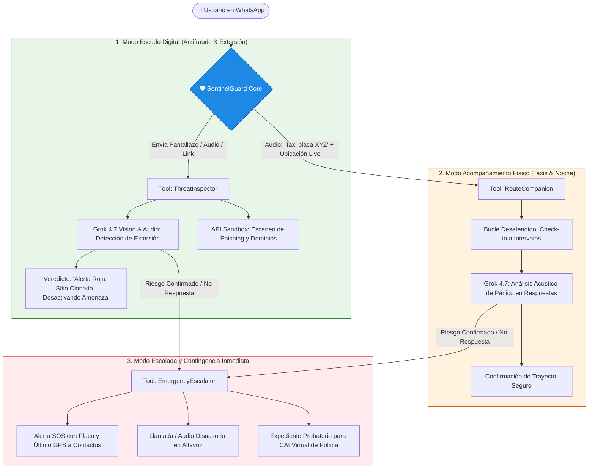

# 🛡️ SentinelGuard AI
### *El Guardaespaldas Autónomo Ciudadano (Digital & Físico)*

[](https://reto.pltk.mx/)
[-black.svg)](https://x.ai/)
[](#-equipo-codixia)
[](https://www.python.org/)

> **Protección integral 24/7 en WhatsApp: destruye estafas y extorsiones digitales con visión multimodal y cuida tu espalda en las calles y taxis en tiempo real con monitoreo desatendido.**

---

## 👥 Equipo Codixia
* **Nicolle**
* **Santiago**
* **Miguel**
* **Fabián Aguilera**
* **Juan José**

*Ecosistema de Talento Campuslands · 2026*

---

## 📌 1. El Problema Real

En Colombia y Latinoamérica, la delincuencia opera hoy en una intersección crítica entre lo **digital** y lo **físico**:

1. **Terrorismo Psicológico y Extorsión Digital**:
   - Más del **70% de los ciudadanos** han recibido mensajes o llamadas fraudulentas: suplantaciones de Nequi/Bancolombia, falsos premios, arriendos trampa en Marketplace y extorsiones carcelarias amenazando a sus familias.
   - La gente pierde los ahorros de su vida o entra en pánico porque no tiene a quién consultar en los 30 segundos críticos de la llamada o el mensaje.

2. **Vulnerabilidad Física en Calles y Transporte Informal**:
   - Miedo constante al tomar un taxi de noche o caminar por calles desoladas en ciudades como Bogotá, Medellín, Bucaramanga o Cali.
   - Las apps tradicionales de mapas son pasivas: muestran una ruta, pero **no reaccionan si el vehículo se detiene en un callejón oscuro** o si el pasajero está siendo amenazado en silencio.

**SentinelGuard AI** nace para ser el copiloto proactivo que interviene en segundos para proteger la vida y el patrimonio del ciudadano.

---

## 🏗️ 2. Arquitectura del Agente

SentinelGuard implementa un ciclo de vida verdaderamente autónomo:



---

## ⚙️ 3. Las 3 Herramientas Reales (Tools)

1. **`ThreatInspector`**:
   - Extrae texto y patrones de ingeniería social desde capturas de pantalla de WhatsApp usando la visión de Grok.
   - Analiza URLs sospechosas mediante inspección remota de dominios y detección de certificados clonados.
   - Clasifica la amenaza: *Phishing Bancario*, *Extorsión Carcelaria*, *Falsa Oferta Laboral*, o *Legítimo*.

2. **`RouteCompanion`**:
   - Recibe la placa del vehículo, destino y ubicación compartida.
   - Despliega un temporizador autónomo en segundo plano (*timer loop*) para realizar chequeos proactivos.
   - Procesa audios de respuesta del usuario evaluando señales acústicas de estrés, coacción o palabras clave de seguridad.

3. **`EmergencyEscalator`**:
   - Ante la confirmación de peligro o falta de respuesta al check-in, compila un paquete de telemetría de emergencia (última coordenada, foto del taxi, placa, historial de audios).
   - Despacha alertas a los contactos de confianza registrados.
   - Genera una alerta disuasiva de audio en altavoz ("*Vehículo monitoreado por Central de Seguridad*") y redacta el expediente estructurado para el CAI Virtual.

---

## 🧠 4. Ingeniería sobre Grok (xAI)

SentinelGuard aprovecha las fortalezas exclusivas del modelo **Grok 4.7**:
- **Razonamiento Multimodal**: Análisis visual de comprobantes de pago falsos y capturas de chats adulteradas.
- **Detección de Manipulación Psicológica**: Identifica sesgos de urgencia fabricada, miedo y autoridad falsa típicos de la extorsión en América Latina.
- **Toma de Decisiones bajo Incertidumbre**: Evalúa falsos positivos antes de disparar alarmas de emergencia a familiares.

---

## 🚀 5. Instalación y Ejecución Rápida

### Requisitos Previos
* **Python 3.10 o superior** (probado en Python 3.14).
* Conexión a Internet y llave del Reto Agente (`pk_...`).

### Paso a Paso

1. **Clonar el repositorio**:
   ```bash
   git clone https://github.com/alejandro-xoxo/platica_mx.git
   cd platica_mx
   ```

2. **Crear y activar el entorno virtual**:
   ```bash
   python -m venv .venv
   # En Windows:
   .venv\Scripts\activate
   # En Linux/Mac:
   source .venv/bin/activate
   ```

3. **Instalar dependencias**:
   ```bash
   pip install -r requirements.txt
   ```

4. **Configurar las credenciales**:
   Copia el archivo de ejemplo y coloca tu llave asignada:
   ```bash
   cp .env.example .env
   ```
   Edita `.env`:
   ```env
   RETO_API_KEY=pk_tu_llave_asignada_aqui
   RETO_BASE_URL=https://api.reto.pltk.mx/v1
   GROK_MODEL=grok-4.7
   ```

5. **Ejecutar el Agente End-to-End**:
   ```bash
   python main.py
   ```

---

## 📅 6. Hoja de Ruta de los Hitos (Track 1)

* [x] **Semana 1 (S1) · Agente corriendo (Oct 5 - 11)**: Repositorio estructurado, README con fundamentación del problema, cliente contra Grok funcional y simulaciones iniciales de amenazas end-to-end.
* [ ] **Semana 2 (S2) · Herramientas reales (Oct 12 - 18)**: Conexión completa de herramientas modulares (`ThreatInspector`, `UrlSandbox`, `VisionParser`, `PoliceReporter`), tolerancia a fallos, 10 ejecuciones grabadas y video demo de 2 minutos.
* [ ] **Semana 3 (S3) · Datos reales (Oct 19 - 25)**: Set de evaluación con 30+ casos reales de estafas en Colombia, memoria multi-turno, reporte de costo y consumo de tokens.
* [ ] **Semana 4 (S4) · Semana de carga (Oct 26 - Nov 1)**: 1.000 unidades de trabajo procesadas en 12 horas de operación desatendida con bitácora completa.
* [ ] **Cierre Final & Pitch (Noviembre)**: Sesiones de feedback con mentores, pitch deck, video final y postulación a premiación.

> 📚 **Documentación técnica para el equipo y jurados:**
> - [Plan Maestro de Arquitectura y Roles (MASTER_PLAN_CODIXIA.md)](./MASTER_PLAN_CODIXIA.md)
> - [Roadmap Semanal y Asignaciones Específicas (HITOS_Y_ASIGNACIONES.md)](./HITOS_Y_ASIGNACIONES.md)

---

## 📄 Licencia y Transparencia
Proyecto desarrollado para el **Reto Agente 2026** por el equipo **Codixia**. Licencia abierta MIT.
